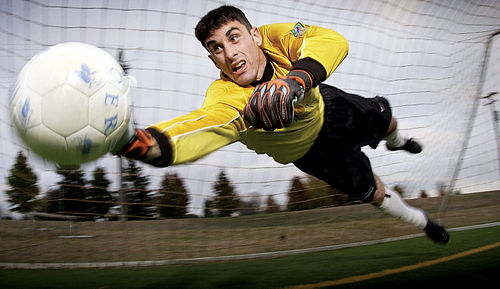
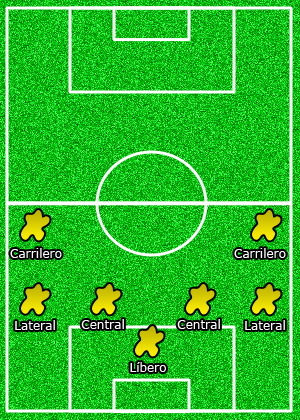
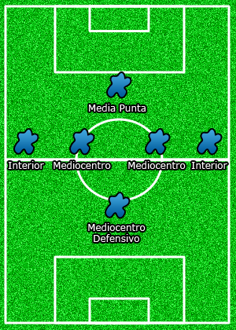
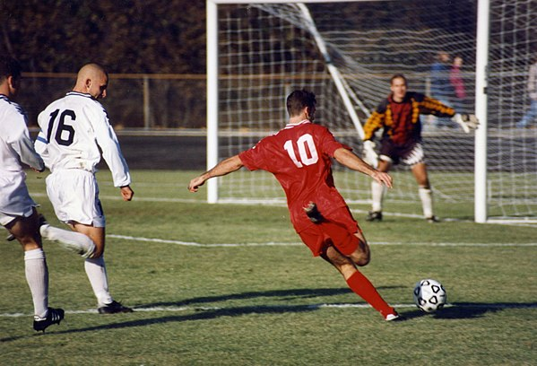

# Practica02-MiSitioWeb-CSS-
<!DOCTYPE html>
<html lang="es" dir="ltr">
  <head>
    <!--
    Practica02
    Futbol
    Author:   Fernando Sánchez
    Date: 19/10/2019
    Filename: index1.html
    -->
    <meta charset="utf-8">
    <title> Futbol</title>
    <link rel="stylesheet" type="text/css" href="css/trescolumnas.css">
    <link rel="stylesheet" type="text/css" href="css/reglas.css">
  </head>
  <body>
    <header class="otro">
      <h1>Jugadores</h1>
    </header>
    <nav id="menu">
      <ul >
        <li><a href="index.html">Inicio</a></li>
        <li><a href="index1.html">Jugadores</a></li>
        <li><a href="index2.html">Estadios</a></li>
        <li><a href="index3.html">Reglas de juego</a></li>
        <li><a href="index4.html">Campeonatos</a></li>
        <li><a href="index5.html">Contacto</a></li>
      </ul>
    </nav>
    <aside class="contenido">
      <section>
        <header>
          <h2>¿Cuántos por cada equipo?</h2>
        </header>
          

            En Hungría, el juego comenzó en la década de 1890 ( la FA se fundó en 1901) y en el primer equipo húngaro había dos jugadores ingleses.
            En Alemania y los Países Bajos, el juego arraigó hacia 1900 (cuando se fundó la FA alemana). Hacia 1908 había 96 clubes holandeses.
            La FA holandesa se fundó en 1889. En 1887, dos propietarios ingleses de hilanderías, los hermanos Charnock, introdujeron el fútbol en
            Rusia cerca de Moscú. A finales de la década de 1890, la Liga de Moscú estaba funcionando.
          

        <header>
          <h3>Arquero</h3>
        </header>
          

            Es el jugador cuyo principal objetivo es evitar que la pelota entre a su meta durante el juego.
            El guardameta es el único jugador que puede tocar la pelota con las manos durante el juego activo,
            aunque sólo dentro de su propia área. Cada equipo debe presentar un único guardameta en su alineación.
          

        <header>
          <h4>Defensa</h4>
        </header>
          

            Es el jugador ubicado una línea delante del guardameta y una por detrás de los centrocampistas,
            cuyo principal objetivo es detener los ataques del equipo rival. Generalmente esta línea de jugadores
            se encuentra en forma arqueada, quedando algunos defensas más cerca del guardameta que los demás.
          

          <header>
            <h5>Centrocampista</h5>
          </header>
            

              Es la persona que juega en el mediocampo en un campo de fútbol. Entre sus funciones se encuentran
              las de recuperar balones, propiciar la creación de jugadas y explotar el juego ofensivo. .
            

         <header>
          <h6>Delantero</h6>
         </header>
          

            Un delantero o atacante es un jugador de un equipo de fútbol que se destaca en la posición de ataque,
            la más cercana a la portería del equipo rival, y es por ello el principal responsable de marcar los goles.
            Es muy importante estar en movimiento y buscar siempre pase, es decir, desmarcarse para que le sea más fácil
            al que lleva la pelota pasársela. La velocidad es esencial.
          

      </section>
    </aside>
    <aside class="lateral">
        
        <header>
          
Arquero

        </header>
        
        <header>
          
 Defensa

        </header>
        
        <header>
          
Centrocampista

        </header>
        
        <header>
          
Delantero

        </header>
    </aside>
    <footer class="otro">
      

			Luis Fernando Sánchez Sucuzhañay &nbsp; Universidad Politécnica Salesiana
			Email: <a href="mailto:lsanchezs3@est.ups.edu.ec">lsanchezs3@est.ups.edu.ec</a>
			Call: <a href="tel:+5930996214346">0996214346</a> Todos los derechos reservados © 

		</footer>

  </body>
</html>
